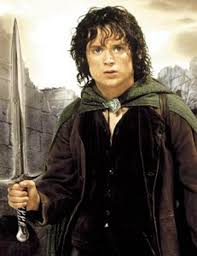
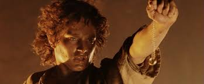
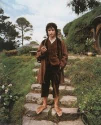

<html lang="en">
<head>
    <meta charset="UTF-8">
    <meta name="viewport" content="width=device-width, initial-scale=1.0">
    <meta name="description" content="This is the story of lil boi Noah.">
    <meta name="author" content="SamTripp">
    <title>Character Profile</title>
</head>
<body>
    <header>
        <h1>Frodo Baggins: Hobbit from the Shire</h1>
        
Explore the life and legacy of Frodo Baggins, the hobbit who saved Middle-Earth.

    </header>
    <main>
        <section>
            <h2>Early Life</h2>
            
Frodo is a Hobbit who was born in the Shire, in Middle-Earth. Frodo was raised by his uncle Bilbo Baggins who was a very well-known and wealthy hobbit. Frodo lived with his uncle in a hobbit hole at the highest peak in Hobbiton.

        </section>
        <section>
            <h2>Journey to Mordor</h2>
            
Frodo was a very well respected hobbit in the Shire who had many good friends. Everything changed when his uncle left him with his old ring. This ring was the all powerful One Ring, forged by the dark lord Souron in the fires of Mount Doom. At the age of 50, Frodo left the shire and ventured to Mordor to destroy the One Ring.

        </section>
        <section>
            <h2>End of His Life</h2>
            <ol>
                <li>Frodo destroyed the One Ring in Mount Doom with his friend Samwise.</li>
                <li>He departs from the Northern region of Middle-Earth and returned the Shire</li>
                <li>He recounts his adventures and completes his uncles book, "A Hobbits Tale".</li>
            </ol>
        </section>
        <section>
            <h3>Frodo Trivia</h3>
            <ul>
                <li>Frodo's Mithril chainmail armor was worth more than the entire Shire</li>
                <li>Frodo knew how to speak some Elvish</li>
                <li>His ancestor invented golf by knocking a goblin head into a gopher hole during battle.</li>
            </ul>
        </section>
        <section>
            <h3>Gallery</h3>
            
            
            
        </section>

    </main>
    <footer>
        
Profile created by Sam Tripp. All images and information are fictional for educational purposes.

    </footer>

</body>
</html>
